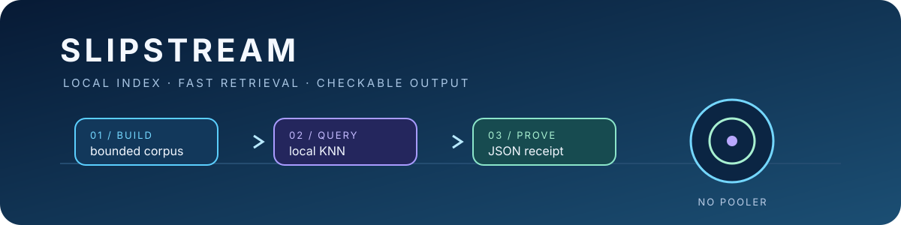

# Slipstream

**A small local vector index for fast, inspectable agent retrieval.**

Slipstream turns caller-owned vectors and metadata into a local SQLite +
`sqlite-vec` index. Build once, query locally, and get stable JSON back. It is
provider-neutral by design: your application owns embedding, while Slipstream
owns the bounded index and the read path.

```text
JSON vectors → local SQLite index → nearest results + timing receipt
```

## Vector inspector

Open the [standalone vector inspector](docs/inspector.html) for a visual readback of the local query path. Its coordinates and distances are synthetic teaching data, clearly labeled as not a benchmark; it has no CDN, hosted service, embedding provider, or sibling repository dependency.

## Install and run

Requires Node.js 20+.

```bash
git clone --branch v0.2.0 --depth 1 https://github.com/jonah-ux/slipstream.git
cd slipstream
npm ci
npm test
```

Build the included synthetic fixture and query it:

```bash
node bin/slipstream.js build --input=examples/items.json --db=.slipstream/demo.db --dim=8
node bin/slipstream.js query --db=.slipstream/demo.db --vector=0.9,0.1,0,0,0,0,0,0 --k=2
node bin/slipstream.js bench --db=.slipstream/demo.db --vector=0.9,0.1,0,0,0,0,0,0 --n=30
node bin/slipstream.js inspect --db=.slipstream/demo.db
node bin/slipstream.js manifest --db=.slipstream/demo.db --out=.slipstream/demo.manifest.json
node bin/slipstream.js verify --db=.slipstream/demo.db --manifest=.slipstream/demo.manifest.json
```

The query response is machine-readable and intentionally explicit:

```json
{
  "schema": "slipstream/query/v1",
  "results": [{"id": "chatlens", "distance": 0.020000...}],
  "elapsed_ms": 0.2
}
```

Run the fully offline round trip at any time:

```bash
npm run demo
```

Inspect a built index without exposing item metadata or embedding values:

```json
{
  "schema": "slipstream/inspect/v1",
  "dimension": 8,
  "item_count": 4,
  "vector_count": 4,
  "ok": true
}
```

`inspect` is a read-only integrity readback. It checks the vector dimension, item/vector parity,
orphan and missing rows, metadata JSON, stable identity digest, and kind counts. Metadata values
are represented by type and SHA-256 only; source tokens and caller-owned values are not printed.

`manifest` adds a stronger content-bound readback. It records the float32 index family, dimension,
metric, SQLite and sqlite-vec versions, runtime build identity, redacted metadata digests, and
per-row digests covering IDs, labels, metadata, and stored vector bytes. `verify` regenerates that
manifest from the current read-only index and refuses changed rows, changed vectors, changed
metadata, dimension drift, or runtime mismatch. Rows are canonically ordered by stable item
identity, and metadata digests use canonical JSON, so equivalent input ordering and object key
ordering produce the same content identity. A failed `verify` command exits non-zero. The manifest
never stores raw vectors or caller metadata; stored vector bytes are labeled little-endian
float32 for the supported sqlite-vec runtime.

## Why this exists

Coding agents repeatedly ask a similar question: *which tool or document is
relevant to this task?* A remote search service adds latency and another
failure boundary. Slipstream keeps the index local, uses memory-mapped reads,
and makes the result easy to inspect in a shell or another agent.

The public repository is the generic core extracted from Jonah's larger
Slipstream work. It deliberately excludes Fleet registries, private memory
corpora, hooks, telemetry, credentials, customer data, and internal adapters.

## Contract

- **Input:** non-empty JSON items with a non-empty string `id` and a fixed-length numeric
  `vector`; optional `kind`, labels, and JSON metadata.
- **Build:** refuses empty or all-invalid inputs and replaces the index only
  after a complete temporary build succeeds.
- **Query:** returns nearest items with distances, stable schema names, and
  elapsed time; optional `--kind` filtering is supported.
- **Inspect:** reads the index without mutation and reports whether its tables,
  vector rows, metadata, and identity summary agree.
- **Manifest:** emits a redacted content identity that another consumer can
  verify later without exposing vectors or caller-owned metadata.
- **Failure:** non-zero exit codes and concise stderr messages; no hidden
  network calls or credential reads.

The package entrypoint exposes the library API from [`lib/engine.js`](lib/engine.js).
The CLI is a thin, agent-friendly wrapper in [`bin/slipstream.js`](bin/slipstream.js).

## Project status

`0.2.0` is the current public release. The local float-vector path, synthetic
fixture, inspect readback, CLI contract, packed-consumer gate, and offline tests
are covered. Provider adapters, embedding orchestration, and hosted indexes are
intentionally out of scope. The release is verified from its packed artifact in
a clean consumer; native `better-sqlite3` builds remain part of installation.

See [`CHANGELOG.md`](CHANGELOG.md), [`SECURITY.md`](SECURITY.md), and
[`CONTRIBUTING.md`](CONTRIBUTING.md) before opening a change.
